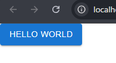

## Material UI を使って ToDo リストを作る取っ掛かり

MUI のインストール方法

[公式ドキュメントを参照
](https://mui.com/material-ui/getting-started/installation/)

```bash
npm install @mui/material @emotion/react @emotion/styled
```

これでインストールは完了

App.tsx に追加してみる。

```tsx
import { Button } from "@mui/material";

function App() {
  return (
    <>
      <Button variant="contained">Hello World</Button>
    </>
  );
}

export default App;
```



## カスタムフックを取り入れる

カスタムフックは、React に搭載されている標準フックの機能を組み合わせて、オリジナルの処理を持つフックを作成することができるそう。アプリケーション内で共通する機能を 1 つにまとめたり、新たな独自の機能を追加することができる便利な仕組みを作ることができる。

ローカルストレージを操作するフックを作成もできる。

```jsx
function useLocalStorage<T>(key: string, initialValue: T) {
  const [value, setValue] = useState<T>(() => {
    const stored = localStorage.getItem(key);
    return stored ? JSON.parse(stored) : initialValue;
  });

  useEffect(() => {
    localStorage.setItem(key, JSON.stringify(value));
  }, [key, value]);

  return [value, setValue] as const;
}
```

これをもとにタスクの追加や削除もできるようになる。(いいね) useTasksっていうフックを作ればコンポーネントはすっきりしそうだね
